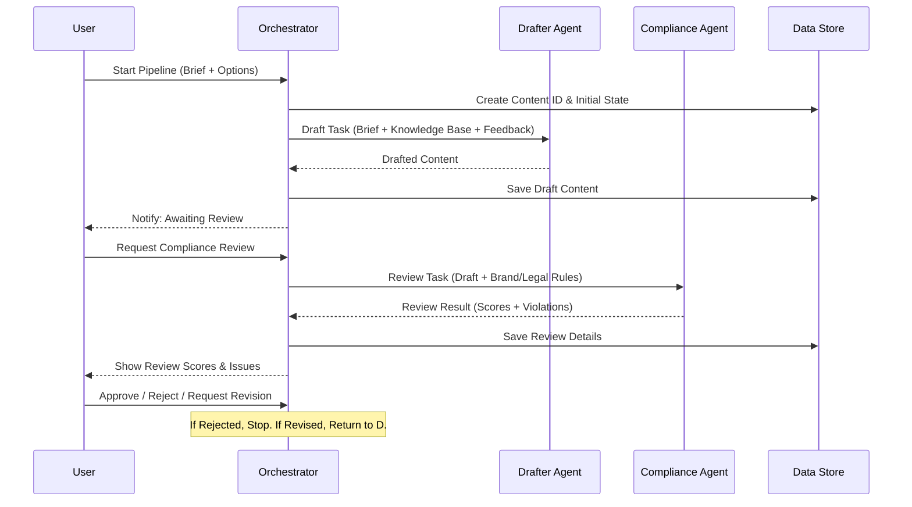

# ContentForge: Enterprise AI Content Operations Architecture

ContentForge is a multi-agent AI system designed to automate the full lifecycle of enterprise content creation, compliance, and distribution. This document provides a detailed technical explanation of the platform's orchestration logic and agent-based design.

---

## 1. System Topology: The Hub-and-Spoke Model
The architecture is built on a **centralized orchestrator** that manages state transitions and handoffs between specialized AI agents. This design ensures that every piece of content has a traceable, auditable history and that agents operate with clear, context-specific boundaries.

### The Role of the Orchestrator
The **Pipeline Orchestrator** (`orchestrator.js`) acts as the single source of truth for all content state. It is responsible for:
- **Routing**: Determining which agent should handle the next task based on the current stage status.
- **Context Injection**: Fetching the exact subset of the Knowledge Base and Brand Guidelines needed for a task and injecting it into the agent's prompt.
- **Persistence**: Ensuring every agent output is saved to the data store before moving to the next stage.

---

## 2. Detailed Pipeline Execution Flow
The following diagram illustrates the lifecycle of a Content Item as it moves through the stages of production, with mandatory human-in-the-loop (HITL) approval gates.

---

## 3. Agent Intelligence & Specialized Logic
ContentForge uses a "Committee of Experts" approach, where each agent is a specialized functional unit with its own internal logic.

### Case Study: The Compliance Reviewer Agent (`reviewer.js`)
The Compliance Agent blends **deterministic rules** with **probabilistic AI reasoning**:
- **Banned Terms**: Directly cross-references content against a list of forbidden terminology from the `brandGuidelines`.
- **Legal Safeguards**: It contains explicit logic to detect health claims in non-healthcare products (a critical regulatory risk in Fintech/SaaS) and flags them with a "CRITICAL" severity.
- **Explainability**: Every violation it finds includes the **exact verbatim sentence** and a **compliant suggestion**, which the UI uses to highlight the content for the user.

### The Feedback & Learning Loop
ContentForge implements a **Closed-Loop Feedback** system:
- When a user selects `Revision Requested` and provides feedback, that feedback is recorded in `data/feedback_history.json`.
- On the next run of that stage, the Orchestrator injects this historical feedback into the agent's prompt, effectively allowing it to "learn from its mistakes" in real-time.

---

## 4. Technical Infrastructure & Resilience

### Data Store & State Management
- **Persistent Store**: All state is stored as JSON in `data/content_items.json`. This allows the server to restart at any time without losing the progress of active content pipelines.
- **Agent Handoffs**: Data is passed between agents via the `Store`, ensuring that no information is lost if an agent call fails.

### Resilience & Soft Fallback Strategy
> [!IMPORTANT]
> The platform is designed to be "partition-tolerant" against AI service interruptions.

1. **Atomic Stage Retries**: If an API call fails (timeout or rate limit), the specific stage is marked as `failed`. The user can "Retry" only that stage without losing progress in others.
2. **Manual Overrides**: Users can bypass AI recommendations at any time, directly editing content to "commit" it as the new ground truth.
