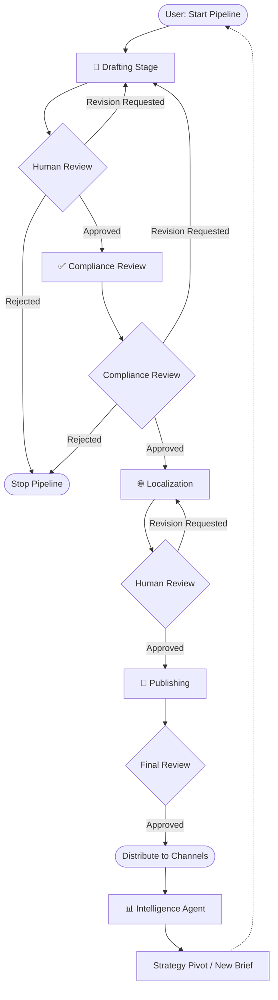
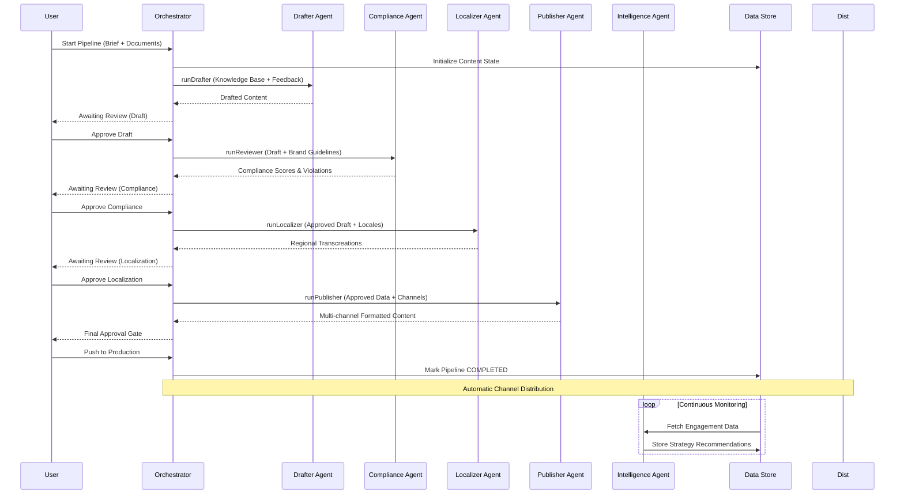

# ContentForge: Enterprise AI Content Operations Architecture

ContentForge is a multi-agent AI system designed to automate the full lifecycle of enterprise content creation, compliance, and distribution. This document provides a detailed technical explanation of the platform's orchestration logic and agent-based design.

---

## 1. System Topology: The Hub-and-Spoke Model
The architecture is built on a **centralized orchestrator** that manages state transitions and handoffs between specialized AI agents. This design ensures that every piece of content has a traceable, auditable history and that agents operate with clear, context-specific boundaries.

### The Role of the Orchestrator
The **Pipeline Orchestrator** (`orchestrator.js`) acts as the single source of truth for all content state. It is responsible for:
- **Routing**: Determining which agent should handle the next task based on the current stage status.
- **Context Injection**: Fetching the exact subset of the Knowledge Base and Brand Guidelines needed for a task and injecting it into the agent's prompt.
- **Persistence**: Ensuring every agent output is saved to the data store before moving to the next stage.

---

## 2. High-Level Pipeline Workflow
The ContentForge pipeline is a state-driven automated workflow with mandatory human-in-the-loop (HITL) approval gates at every transition. The following flowchart illustrates the high-level logic and decision branching.

---

## 3. Detailed Pipeline Execution Flow
The following sequence diagram tracks the precise handoffs between the **Pipeline Orchestrator**, all five specialized AI agents, and the persistent data store.

---

## 4. Stage-by-Stage Agent Logic

ContentForge uses a "Committee of Experts" approach, where each agent is a specialized functional unit with its own internal logic and prompt boundaries.

### 1. The Drafter Agent (`drafter.js`)
- **Responsibility**: Strategic content generation.
- **Key Logic**: Performs RAG (Retrieval-Augmented Generation) by reading uploaded PDFs and Word docs to ensure factual grounding in the "Knowledge Base".
- **Handoff**: Produces a `core_draft` that serves as the foundation for all subsequent stages.

### 2. The Compliance Reviewer Agent (`reviewer.js`)
- **Responsibility**: Quality control and risk mitigation.
- **Logic Engine**: 
  - **Deterministic**: Checks for banned terms against a strict list.
  - **Probabilistic**: Uses AI to detect nuanced legal risks (e.g., unsubstantiated medical/financial claims).
- **Explainability**: Returns exact line numbers and "Compliant Suggestions" for every violation found.

### 3. The Localizer Agent (`localizer.js`)
- **Responsibility**: Global transcreation.
- **Logic**: Not just a translator—it adapts idioms, cultural tone, and regional preferences for specific markets (e.g., Hindi, Tamil, Spanish).
- **Quality Check**: Ensures brand consistency is maintained while achieving local resonance.

### 4. The Publisher Agent (`publisher.js`)
- **Responsibility**: Channel optimization.
- **Logic**: Knows the specific metadata requirements for different platforms (LinkedIn hashtags, X char limits, Email subject line best practices).
- **Output**: Generates a bundle of ready-to-post assets from the singular approved draft.

### 5. The Intelligence Agent (`intelligence.js`)
- **Responsibility**: Post-performance analysis and strategic pivoting.
- **Data Loop**: Analyzes live engagement data (views, clicks, conversions) and calculates ROI.
- **Feedback**: If content types (e.g., video) massively outperform others, it generates "Strategic Pivots" to suggest shifts in the content calendar.

---

## 5. Technical Infrastructure & Resilience

### The Feedback & Learning Loop
ContentForge implements a **Closed-Loop Feedback** system:
- When a user selects `Revision Requested` and provides feedback, that feedback is recorded in `data/feedback_history.json`.
- On the next run of that stage, the Orchestrator injects this historical feedback into the agent's prompt, effectively allowing it to "learn from its mistakes" in real-time.

### Data Store & State Management
- **Persistent Store**: All state is stored as JSON in `data/content_items.json`. This allows the server to restart at any time without losing the progress of active content pipelines.
- **Atomic Stage Retries**: If an API call fails (timeout or rate limit), the specific stage is marked as `failed`. The user can "Retry" only that stage without losing progress in others.
- **Manual Overrides**: Users can bypass AI recommendations at any time, directly editing content to "commit" it as the new ground truth.
